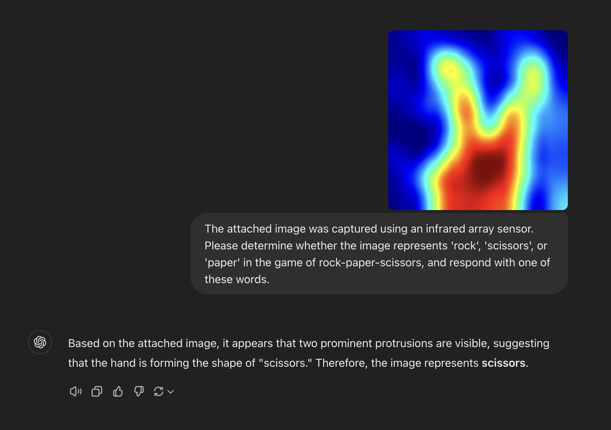

# Personalized Customer Experiences (CX)

This pages is just technical: I know it is difficult to apply an Open AI's LLM to automatic personal profiling in terms of personal info protection, and we need an on-premise LLM instead.

A certain showroom obtains consent from visitors for the use of facial recognition. Similarly, consent should be obtained when using generative AI for profiling. If that is not possible, other methods, such as Bluetooth tags, will need to be relied upon.

## What Generative AI can contiribute to Personalized CX

### Object Detection

As demonstrated by [the experiment](https://youtu.be/1yXJCsx69_0) I conducted, GPT-4o-mini excels at image recognition and can perform object detection to some extent. However, for accurately identifying the positions of objects, it is better to rely on AI specifically designed for object detection.

### Image Classification

What I have observed:

- gpt-4o-mini is not particularly good at determining a person’s gender, age, or expression and tends to refuse to answer, but it can provide guesses depending on the prompt.
- It answers accurately to questions about what people are doing, which direction they are facing, or how many people are present.
- It also provides accurate descriptions of the environment where people are located.

Therefore, image recognition and classification by GPT-4o-mini can be applied to the generation of dynamic marketing content tailored to visitors.

### Prompt for character profiling

```
Please guess the gender, the age, the race, if wearing glasses, the hair style, the clothing of the person in the attached image. Never answer like "unknown" even if you are confident with the answer. Output only the data in the following format:

- male, 40, asian, yes, short, t-shirt
- female, 25, caucasian, no, straight long, suit
- ... 
```

Answered by gpt-4o-mini:
```
- male, 30, asian, no, short, polo shirt
```

## Experiment system

```
                    [OpenAI API Service]
                            |
Billboard                   |
[Web app]----------------[app.py]---[Content DB]
                            |
             [USB webcam]---+
                            |
              Push URL      |
[Smart phone] <- - - [NFC tag writer]
```

### Content DB

The database keeps YouTube URLs for various character profiles, gender, age and clothing:
```
CREATE TABLE youtube_urls (description TEXT, url TEXT);
```

## Image Classification with Infrared Array Sensor

If using a camera poses privacy concerns, let's try using an infrared array sensor.


