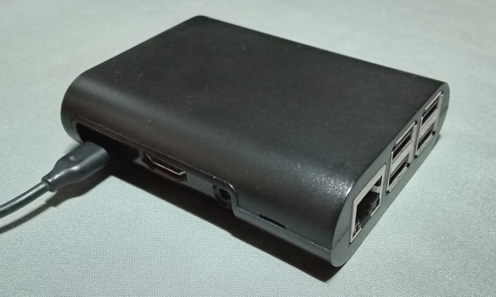
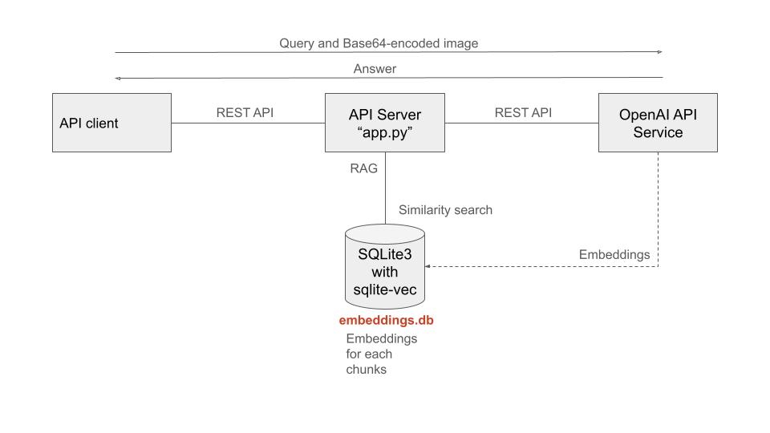

# Showroom Controller

(Work in progress)

Showroom Controller that runs on Raspberry Pi.



## Background

I will prototype a controller to implement the Personalized CX described in Kotler's Marketing 5.0 for real-world touchpoints.

For the prototype, I will use electronics platforms like Raspberry Pi and Arduino Uno, integrating various sensors and actuators.

In terms of utilizing LLM, I will develop a compact RAG (Retrieval-Augmented Generation) model to run on the Raspberry Pi. As the database for RAG, we will adopt SQLite and implement a vector DB using [sqlite-vec](https://github.com/asg017/sqlite-vec).

This controller will also function as a controller for [virtual showroom](https://github.com/araobp/virtual-showroom).

## Goal of this project

- Develop a compact RAG that can run on my Raspberry Pi 3 Model B.
- Work with various sensors/actuators via Arduino Uno.
- The RAG will support Hybrid RAG: SQL DB, Vector DB and Graph DB.
- The RAG will also work as an API server for my other project: [virtual-showroom](https://github.com/araobp/virtual-showroom).
- Develop AI Agents for some use cases: "Showroom Controller" (sort of Programmable Logic Controller (PLC)).

## Requrements

- OpenAI API key
- LLM model: gpt-4o-mini
- Embeddings model: text-embedding-3-small
- Raspberry Pi
- USB devices such as a webcam (optional)
- Arduino UNO and sensors/actuators (optional)

## Architecture

```
                                   Brain
                           [OpenAI API service]
   Unity app                         |
[VirtualShowroom]-----+              |
                      |              |
   Web apps           |       Compact RAG (app.py)
[Web Browser]---------+------- [Raspberry Pi]---+---USB---[Camera with mic]
                                     |          |
                                 SQLite DB      +---USB---[Speaker]
                                                |
                                                +---USB Serial---[Arduino Uno]---[Sensors/Actuators]
```

## Compiling sqlite-vec on Rapsberry Pi

```
$ git clone https://github.com/asg017/sqlite-vec
$ cd sqlite-vec
$ sudo apt-get install libsqlite3-dev
$ make all
```

Find "vec0.so" in ./dist directory.

## Reference documents, chunking and embeddings for RAG

### Document sources

- [Virtual Showroom](./ref/virtual_showroom)

### Chunking and Embeddings

- [Step 1. Generating Chunks](./ref/Chunks.ipynb): I run this notebook on my Mac.
- [Step 2. Calculating embeddings](./ref/calc_embeddings.py): I run this script on my Raspberry Pi 3.

## Compact RAG as an API server based on Flask



### Implementations

- [Compact RAG modules](./rag)
- [API server](./app)

### Unit tests

- [Unit tests for compact RAG modules](./unittest/rag)
- [Unit test for the API server](./unittest/api)

## Running the API server

```
$ cd app
$ python app.py
```

The API server provides simple web apps. Access "http://\<IP address of the API server\>:5050" with a web browser.

[virtual-showroom](https://github.com/araobp/virtual-showroom) uses this API server to access the OpenAI API service.

### Starting the API server automatically

Refer to [this article](https://ponnala.medium.com/never-let-your-python-http-server-die-step-by-step-guide-to-auto-start-on-boot-and-crash-recovery-1f7b0f94401e) to start the server automatically.

A sample service file is like this:

```
[Unit]
Description=Python Generative AI API server
After=network.target

[Service]
ExecStart=/usr/bin/python3 -m app --directory <Path to app.py>
WorkingDirectory=/home/arao/compact-rag/app
Restart=always
RestartSec=10
User=arao
Group=users
Environment="OPENAI_API_KEY=<OpenAI API key>"

[Install]
WantedBy=multi-user.target
```

After having created the service file, do this:

```
$ sudo systemctl daemon-reload
$ sudo systemctl start gen_ai.service
```

Confirm the daemon process running:

```
$ sudo systemctl start gen_ai.service
```

If something wrong happened, check the syslog:
```
$ tail /var/log/syslog
```

## References

- [HybridRAG: Integrating Knowledge Graphs and Vector Retrieval Augmented Generation for Efficient Information Extraction](https://arxiv.org/html/2408.04948v1)
- [Bach Network](https://github.com/araobp/bach-network)
- [OpenAI Realtime API](https://hunch.tools/blog/open-ai-realtime-api-in-python/)
